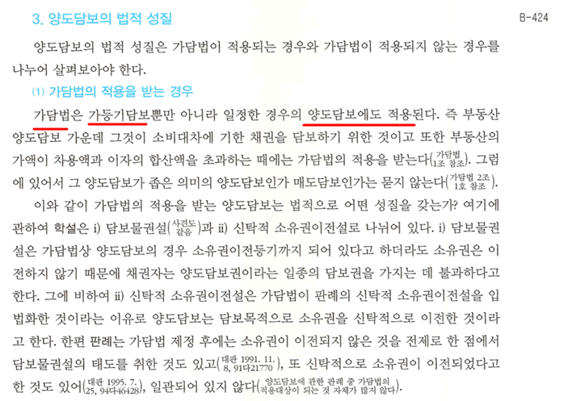

<link rel="stylesheet" href="../_res/darkmode.css">

가담법▶가등기담보  
가담법▶양도담보  

---
<pre>
가담법
ㄴ가등기담보
ㅤㄴ가등기
ㄴ양도담보
ㅤㄴ이전등기

- 가담법
  - 가등기담보
    - 가등기
  - 양도담보
    - 이전등기
</pre>
<pre>
   가담법▶가등기
   가담법▶이전등기

   가담법▶가등기ㅤ▶가등기담보
   가담법▶이전등기▶양도담보

   가담법▶가등기ㅤ▶가등기담보
   가담법▶이전등기▶양도담보

   가담법▶가등기ㅤ▶가등기담보
   가담법▶이전등기▶양도담보

   가담법▶가등기담보
   가담법▶양도담보
</pre>

#
